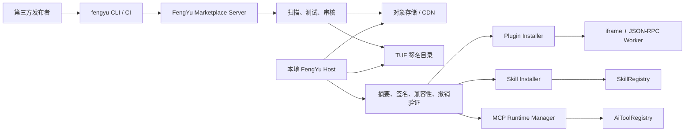

# FengYu 统一扩展市场完整实施计划

> 状态：待实施  
> 日期：2026-08-11  
> 范围：FengYu Host、FengYu Marketplace Server、插件工具链、桌面端、前端与发布流水线  
> 目标版本：4.x 增量交付，不改变 4.0.0 插件运行时基本契约

## 1. 计划目标

本计划作为插件、Skill、MCP 市场建设的唯一总入口，覆盖以下全部能力：

- FengYu `.fyp` 插件市场；
- `.fys` Skill 市场；
- MCP Server 市场；
- 第三方开发者注册、上传、审核、发布和撤销；
- 发布者签名、市场签名、官方命名空间保护和密钥轮换；
- 应用与扩展的更新检测、下载、验证、安装、回滚和撤销；
- FengYu Host、公开市场服务、CLI、前端、Electron、CI/CD 和文档；
- 旧目录、旧 API、现有安装记录和四个官方插件的兼容迁移。

最终交付一个统一的 **Extensions Market**。三类扩展共享目录、发布者、签名、版本、更新、审核和审计机制，但继续使用相互独立的运行时：

| 类型 | 交付格式 | 运行方式 |
| --- | --- | --- |
| Plugin | `.fyp` | sandboxed iframe + 独立 JSON-RPC Worker |
| Skill | `.fys` | `SKILL.md` 渐进式加载 |
| MCP | 签名 MCP 清单或安装包 | 动态 MCP Client；STDIO 进程必须沙箱化 |

本计划禁止重新引入 JavaFX、进程内 Spring 插件、`ServiceLoader` 插件 SPI 或宿主 classpath 共享。

## 2. 既有基线

### 2.1 FengYu Host 已有能力

- `/api/plugin-market` 支持 `.fyp` 浏览、上传、安装、更新、启用、禁用和卸载；
- `/api/skills` 支持 `.fys` 市场和完整生命周期；
- `/api/plugin-store` 已聚合 FengYu、Claude Code 和 Codex 市场来源；
- `AgentContentInstaller` 已能从 Git 安装第三方 Skill 内容并落盘 MCP 配置；
- `PluginIntegrityStore` 已能记录 manifest 与整个安装目录的 SHA-256 摘要；
- Plugin Worker 继续使用独立进程、JSON-RPC、FileRef、权限门禁和 OS 沙箱；
- MCP 工具可通过 Spring AI 启动期配置进入 `AiToolRegistry`；
- 应用更新已覆盖 GitHub/FY-Proxy、Electron 和 portable JAR。

### 2.2 Marketplace Server 已有能力

以下日期化计划已经在独立 `fengyu-marketplace-server` 仓库完成，保留为历史执行记录：

- `2026-08-04-marketplace-server-plan-0-scaffold.md`：服务脚手架；
- `2026-08-04-marketplace-server-plan-1-auth.md`：认证中心；
- `2026-08-04-marketplace-server-plan-2-publish.md`：`.fyp` 投稿、校验和审核；
- `2026-08-04-marketplace-server-plan-3-catalog.md`：目录聚合与多格式发布；
- `2026-08-04-marketplace-server-plan-4-frontend.md`：市场管理和发布前端。

本计划不重复建设上述 v1 能力，而是在其上补齐 Skill、MCP、签名、安全更新和 Host 整合。

## 3. 必须优先修复的缺口

### P0：身份与供应链

- `.sha256` sidecar 只能证明内容未意外损坏，不能证明发布者身份；不得再用它授予官方身份；
- `fan.summer.*` Plugin、Skill 和 MCP ID 必须仅允许官方公钥验证通过的制品使用；
- Skill 本地上传当前需要补齐与 Plugin 一致的官方命名空间保护；
- 本地 unsigned sideload 必须标记为 `LOCAL_UNSIGNED`，不得显示“官方”或“已验证发布者”；
- 安装时必须同时验证目录元数据、制品摘要、发布者签名、市场签名、兼容范围和撤销状态。

### P0：版本与更新

- 统一目录对象必须拆分 `availableVersion` 和 `installedVersion`；
- 使用完整 SemVer 比较，包括 prerelease；
- 更新失败必须恢复旧版本和启用状态；
- 同版本不同内容必须视为不同制品并重新验证，禁止静默覆盖已发布版本。

### P0：网络与文件安全

- 市场源和制品下载增加 SSRF 防护；
- 拒绝回环、云元数据地址和未经允许的私网目标；
- DNS 解析和每次重定向后都必须重新校验目标；
- 保留响应大小、压缩包大小、展开大小、路径穿越和 symlink 防护；
- 投稿扫描服务不得在无隔离环境中执行第三方代码。

### P1：MCP 运行时

- 当前写入 `<runtime>/mcp-servers/*.json` 的市场配置不会动态生效；
- MCP 仍是启动期 Spring 配置，需要新增动态生命周期管理；
- MCP Secret 必须与普通设置、目录元数据和安装记录分离；
- STDIO MCP 等同执行第三方本机命令，必须单独授权和沙箱化。

## 4. 目标架构



架构边界：

- FengYu Host 继续只绑定 `127.0.0.1`，负责本机安装、授权和运行；
- Marketplace Server 独立部署，负责账号、投稿、审核、元数据和文件分发；
- 制品进入对象存储/CDN，市场数据库只保存元数据和对象引用；
- Host 不信任清单内自报的 `official`，最终信任等级只能由签名验证结果产生；
- Plugin、Skill、MCP 共用市场领域模型和安全更新框架，但各自使用专用 Installer/Runtime。

## 5. 统一领域模型

### 5.1 扩展类型

新增：

```java
public enum ExtensionKind {
    PLUGIN,
    SKILL,
    MCP
}
```

### 5.2 信任等级

```java
public enum TrustLevel {
    OFFICIAL,
    VERIFIED_PUBLISHER,
    COMMUNITY,
    LOCAL_UNSIGNED,
    REVOKED
}
```

语义：

- `OFFICIAL`：FengYu 官方发布密钥签名；
- `VERIFIED_PUBLISHER`：已验证第三方发布者签名且经市场发布；
- `COMMUNITY`：市场审核通过，但发布者身份验证等级较低；
- `LOCAL_UNSIGNED`：本地侧载、未验证来源；
- `REVOKED`：版本或密钥已撤销，禁止新装并停用已安装实例。

### 5.3 统一目录对象

新增 `CatalogEntryV2`，至少包含：

```text
uid
kind
id
publisherId
displayName
description
category
keywords
homepage
icon
availableVersion
installedVersion
channel
updateAvailable
trustLevel
verificationStatus
artifactUrl
artifactSha256
artifactSize
signatureBundleUrl
minHostVersion
maxHostVersion
permissions
capabilities
releaseNotes
publishedAt
revoked
```

### 5.4 本地持久化

新增或迁移：

- `marketplace_sources`；
- `installed_extensions`；
- `extension_update_policies`；
- `trusted_publishers`；
- `trusted_signing_keys`；
- `extension_install_events`；
- `mcp_instances`；
- `mcp_secret_refs`；
- `extension_revocations`。

`installed_extensions` 保存：

```text
uid, kind, extension_id, publisher_id, source_origin,
installed_version, artifact_digest, manifest_digest,
signing_key_id, trust_level, verification_status,
enabled, install_path, installed_at, updated_at,
last_update_check_at, rollback_path
```

现有 `store_sources` 和 `plugin_install_records` 通过迁移脚本导入；旧表至少保留一个兼容版本。

## 6. 目录、签名与更新协议

### 6.1 Catalog V2

```json
{
  "schemaVersion": 2,
  "generatedAt": "2026-08-11T00:00:00Z",
  "expiresAt": "2026-08-12T00:00:00Z",
  "sequence": 42,
  "entries": [
    {
      "kind": "PLUGIN",
      "id": "com.example.excel",
      "publisherId": "pub_example",
      "latest": {
        "version": "1.2.0",
        "channel": "stable",
        "artifactUrl": "https://cdn.example/extensions/example-1.2.0.fyp",
        "sha256": "...",
        "size": 123456,
        "signatureBundleUrl": "https://cdn.example/extensions/example-1.2.0.bundle",
        "minHostVersion": "4.0.0",
        "permissions": ["files.read"]
      }
    }
  ]
}
```

### 6.2 TUF 元数据

市场发布：

- `root.json`：根密钥和轮换规则；
- `targets.json`：制品路径、摘要、长度和自定义元数据；
- `snapshot.json`：目录快照版本；
- `timestamp.json`：短期有效时间。

Host 必须验证：

- 根信任和签名阈值；
- timestamp 是否过期；
- snapshot/targets 版本是否回退；
- target 长度和 SHA-256；
- extension ID、kind、version 与 target 元数据是否一致。

### 6.3 两层制品签名

每个发布版本包含：

1. 发布者签名：证明由谁发布；
2. 市场签名/证明：证明市场已接收、扫描、审核和发布。

采用 DSSE/in-toto 声明，绑定：

```text
kind
extensionId
version
publisherId
artifactSha256
manifestSha256
artifactSize
createdAt
keyId
minHostVersion
permissionsDigest
```

不得自定义“对 ZIP 某段字符串签名”的临时协议。

### 6.4 密钥管理

- 官方离线根私钥不得进入 CI；
- CI 使用有期限的发布密钥或 OIDC/Sigstore keyless；
- Host 内置官方根公钥并支持轮换；
- 第三方可注册多把 Ed25519 发布密钥；
- 私钥保存在系统 Keychain、HSM 或 CI OIDC 流程中；
- 密钥撤销不能删除历史审计记录；
- `fan.summer.*` 仅接受官方密钥链。

## 7. 第三方投稿与发布

### 7.1 本地安装与公共发布分离

- `/api/plugin-market/upload`、`/api/skills/upload` 保留为“本地安装”；
- UI 中统一命名为“从本地安装”；
- 公共市场投稿只能走 Marketplace Server；
- 本地安装不得创建市场发布者身份或进入公开目录。

### 7.2 CLI 流程

```bash
fengyu plugin build ./my-plugin
fengyu extension sign dist/my-plugin.fyp
fengyu marketplace login
fengyu marketplace publish dist/my-plugin.fyp
```

Skill/MCP：

```bash
fengyu skill build ./my-skill
fengyu marketplace publish dist/my-skill.fys

fengyu mcp validate fengyu.mcp.json
fengyu marketplace publish fengyu.mcp.json
```

### 7.3 投稿状态机

```text
DRAFT
  -> UPLOADING
  -> VALIDATING
  -> SCANNING
  -> REVIEW_PENDING
  -> APPROVED
  -> PUBLISHED

任一步可进入 REJECTED / FAILED / WITHDRAWN / REVOKED
```

### 7.4 投稿流程

- [ ] 发布者通过 GitHub/OIDC 登录；
- [ ] 建立发布者资料并验证邮箱/组织/主页；
- [ ] 申请或验证命名空间；
- [ ] 创建 submission 并取得预签名上传 URL；
- [ ] 制品、签名和 SBOM 直传对象存储；
- [ ] Marketplace Server 校验摘要与声明；
- [ ] 运行静态扫描和隔离冒烟测试；
- [ ] 高风险权限进入人工审核；
- [ ] 审核通过后写入不可变版本；
- [ ] 生成市场证明和 TUF targets；
- [ ] 发布至 CDN 并回读验证；
- [ ] 通知发布者结果。

已发布版本禁止原地覆盖；修复必须使用新版本号。

### 7.5 自动扫描

必须覆盖：

- manifest/schema；
- ID、kind、version 与 submission 一致；
- ZIP Slip、symlink、ZIP bomb、重复路径和大小写冲突；
- 原始包大小、展开大小、文件数量和单文件大小；
- Worker JAR 主类、依赖边界和 JSON-RPC 冒烟；
- iframe CSP 和禁止直连网络；
- Java/JS 依赖漏洞、恶意软件和 secret；
- SBOM、许可证和来源信息；
- 权限与实际能力一致性；
- AI tool input/output schema；
- 16 MiB JSON-RPC frame 限制；
- install/enable/invoke/disable/uninstall 生命周期。

高风险权限必须人工审核：`network`、`network.email`、`database`、`files.write`、STDIO MCP。

## 8. Plugin 市场实施

新增 Host 模块：

```text
extension/catalog/
extension/security/ArtifactVerificationService
extension/security/PublisherTrustService
extension/install/PluginExtensionInstaller
extension/update/ExtensionUpdateService
```

安装和更新流程：

1. 拉取并验证 TUF metadata；
2. 检查版本、channel、宿主兼容性和撤销状态；
3. 下载至 staging，限制长度和响应大小；
4. 验证 target 长度、SHA-256、发布者签名和市场证明；
5. 解包并执行现有 manifest、路径、权限和大小校验；
6. 展示权限和版本差异，等待用户授权；
7. `beginUpdate` 停止旧 Worker 并阻止并发 invoke；
8. 原子替换 package，保留 rollback；
9. 记录整个包目录摘要；
10. 执行 Worker 健康检查或最小 RPC；
11. 成功后清理旧版本，失败恢复 rollback；
12. `endUpdate` 恢复调用。

以下契约保持不变：iframe sandbox、`postMessage` bridge、JSON-RPC Worker、FileRef、独立 classpath、最小权限和 OS 进程沙箱。

## 9. Skill 市场实施

`.fys` 保持：

```text
manifest.json
SKILL.md
assets/
references/
scripts/
```

实施项：

- [ ] SkillPackageService 接入统一 ArtifactVerificationService；
- [ ] 增加官方命名空间保护和 trust level；
- [ ] 增加 `minHostVersion`、channel、撤销和签名字段；
- [ ] 扫描 Markdown 外链、资源大小、symlink 和可执行脚本；
- [ ] 更新前展示正文摘要/diff；
- [ ] 记录整个 `.fys` 安装目录摘要；
- [ ] 被撤销 Skill 自动禁用但不自动删除用户数据；
- [ ] Skill Registry 在安装、更新、启用和禁用后立即刷新。

Skill 不得无条件自动更新，因为内容会改变模型行为。自动更新仅允许同时满足：

- 同一有效发布密钥；
- patch 版本；
- 无新增脚本或可执行资源；
- 无信任等级下降；
- 用户显式开启 Skill 自动更新。

## 10. MCP 市场实施

### 10.1 MCP 清单

新增 `fengyu.mcp.json`：

```json
{
  "schemaVersion": 1,
  "id": "com.example.search-mcp",
  "name": "Search MCP",
  "version": "1.0.0",
  "publisherId": "pub_example",
  "transport": {
    "type": "streamable-http",
    "url": "https://mcp.example.com/mcp"
  },
  "auth": {
    "type": "oauth2",
    "secretNames": []
  },
  "networkDomains": ["mcp.example.com"],
  "minHostVersion": "4.0.0"
}
```

市场目录和清单不得包含真实凭据。

### 10.2 动态运行时

新增 `McpRuntimeManager`：

- 持久化已安装服务器定义；
- 单服务器 connect/disconnect/restart；
- 动态创建和销毁 MCP client；
- 健康检查、重连、超时和熔断；
- 获取服务器工具并动态更新 `AiToolRegistry`；
- 单服务器启用/禁用；
- 更新后重建 client；
- 卸载时清理配置和 secret reference；
- 记录服务器、工具和调用审计。

### 10.3 实施顺序

第一阶段支持：

- HTTPS Streamable HTTP；
- HTTPS SSE；
- OAuth2；
- API Key secret reference。

第二阶段支持 STDIO，必须满足：

- 安装包和发布者签名验证通过；
- UI 展示完整 command/args/env；
- 禁止 shell 字符串，只接受可执行文件和参数数组；
- 可执行文件必须位于已验证安装目录；
- 用户单独授权；
- 复用 Plugin Worker 的进程沙箱；
- 默认禁止文件和网络访问；
- command、args、env 或网络域名变化时重新授权。

### 10.4 Secret 管理

- Desktop 使用系统 Keychain；
- Portable 建立独立加密 Secret Store；
- 数据库只保存 `secretRef`；
- 日志、错误、目录、安装历史不得出现真实值；
- MCP 更新不得覆盖或上传用户 Secret；
- 卸载时允许用户选择保留或删除 Secret。

## 11. 更新系统

### 11.1 应用更新

保留现有模式：

- Desktop：Electron updater；
- Portable：后端 JAR 自更新；
- Browser：提示管理员更新；
- GitHub Releases/FY-Proxy 双来源。

补齐：

- Windows 代码签名；
- macOS 签名和 notarization；
- Linux 发布摘要和签名；
- 正式代码签名前桌面继续只提示手动下载；
- stable/beta/rc channel；
- 最低安全版本和应用版本撤销。

### 11.2 扩展检查

- 启动后延迟检查一次；
- 默认每 6 小时检查；
- 支持 `ETag`/`If-None-Match`；
- 网络失败指数退避；
- 手动强制刷新；
- 验证 TUF sequence 和过期时间；
- 按 SemVer、channel 和 host compatibility 计算更新；
- 一个市场源失败不得阻断其他来源，保留上次可信缓存并标记 stale。

### 11.3 更新策略

```text
NOTIFY_ONLY
AUTO_PATCH
AUTO_MINOR
MANUAL
```

默认 `NOTIFY_ONLY`。以下变化无论用户策略如何都强制确认：

- 权限增加；
- 发布者密钥变化；
- trust level 下降；
- MCP command/args/env/域名变化；
- 新增 Secret；
- 主版本升级；
- Skill 新增脚本；
- 被撤销版本的替换安装。

### 11.4 回滚

安装目录维护：

```text
current/
rollback/
staging/
```

更新失败必须：

1. 停止新 Worker/MCP；
2. 恢复 rollback；
3. 恢复旧 enabled 状态；
4. 重启旧 Worker/MCP；
5. 记录失败原因和制品摘要；
6. 暂停失败版本再次自动更新。

## 12. Host REST API

统一新增：

```text
GET    /api/extensions/catalog
GET    /api/extensions/installed
GET    /api/extensions/updates
GET    /api/extensions/{uid}

POST   /api/extensions/{uid}/install
POST   /api/extensions/{uid}/update
POST   /api/extensions/{uid}/rollback
PATCH  /api/extensions/{uid}/enabled
DELETE /api/extensions/{uid}?deleteData=true|false

POST   /api/extensions/upload
POST   /api/extensions/upload-native

GET    /api/extensions/sources
POST   /api/extensions/sources
PATCH  /api/extensions/sources/{origin}
DELETE /api/extensions/sources/{origin}
POST   /api/extensions/sources/{origin}/refresh

GET    /api/extensions/audit
GET    /api/extensions/trust/publishers

GET    /api/mcp/instances
POST   /api/mcp/instances/{uid}/connect
POST   /api/mcp/instances/{uid}/disconnect
POST   /api/mcp/instances/{uid}/secrets
GET    /api/mcp/instances/{uid}/tools
```

旧接口至少保留一个应用版本：

- `/api/plugin-market`；
- `/api/plugin-store`；
- `/api/skills`；
- `/api/mcp/status`。

旧 Controller 改为调用统一 service，禁止长期维护两套安装和更新逻辑。

## 13. 前端实施

将当前插件页演进为统一 Extensions 页面，包含：

- 全部；
- Plugin；
- Skill；
- MCP；
- 已安装；
- 有更新；
- 市场来源；
- 本地安装；
- 安装历史。

扩展卡片展示：类型、来源、发布者、trust level、签名状态、版本、兼容性、权限、下载大小和更新时间。

详情页展示：

- 版本历史和发布说明；
- 发布者与签名链；
- 扫描结果和 SBOM；
- 权限和版本 diff；
- Skill 正文摘要；
- MCP transport、域名、工具和 Secret 需求；
- 安装、更新、回滚、禁用、卸载和举报入口。

安装/更新确认必须使用结构化差异页，不能只使用 `window.confirm`。

## 14. Marketplace Server API

在既有认证、投稿、审核和目录 API 上扩展：

```text
POST   /v1/publishers
POST   /v1/publishers/{id}/keys
DELETE /v1/publishers/{id}/keys/{keyId}

POST   /v1/submissions
POST   /v1/submissions/{id}/complete
GET    /v1/submissions/{id}
POST   /v1/submissions/{id}/approve
POST   /v1/submissions/{id}/reject

GET    /v1/extensions
GET    /v1/extensions/{kind}/{id}
GET    /v1/extensions/{kind}/{id}/versions
POST   /v1/extensions/{kind}/{id}/versions/{version}/revoke

GET    /v1/tuf/root.json
GET    /v1/tuf/targets.json
GET    /v1/tuf/snapshot.json
GET    /v1/tuf/timestamp.json
```

新增管理员能力：发布者审核、命名空间审批、扫描报告、版本撤销、密钥撤销、举报处理和紧急下架。

## 15. CLI 与发布流水线

### 15.1 CLI

在 `toolchain/cli` 增加：

```text
fengyu extension sign
fengyu extension verify
fengyu marketplace login
fengyu marketplace whoami
fengyu marketplace publish
fengyu marketplace status
fengyu marketplace revoke
fengyu skill build
fengyu mcp validate
```

保持现有 `fengyu plugin create/build` 行为，不增加不存在的本地 `plugin install` 命令；本地安装仍由 Host UI/API 完成。

### 15.2 官方发布流水线

- [ ] 构建 markdown、excel、email、offlinepython 四个官方插件；
- [ ] 生成 `.fyp.sha256`；
- [ ] 生成 SBOM；
- [ ] 生成发布者签名；
- [ ] 离线验证签名和命名空间；
- [ ] 上传 Marketplace Server；
- [ ] 通过审核策略发布；
- [ ] 更新 TUF targets/snapshot/timestamp；
- [ ] 从 CDN 回读并验证摘要；
- [ ] 再发布应用 Release。

应用版本与插件工具链版本继续独立，不因市场版本发布互相 bump。

## 16. 安全基线

- [ ] 市场 URL 与下载 URL SSRF 防护；
- [ ] DNS 重绑定与重定向校验；
- [ ] HTTPS 默认强制，HTTP 仅限显式本地开发模式；
- [ ] 下载、目录和解包全程有界；
- [ ] ZIP Slip、symlink、重复路径防护；
- [ ] 签名、TUF、兼容性和撤销 fail closed；
- [ ] 防目录回滚和冻结；
- [ ] 权限变化重新授权；
- [ ] 发布密钥轮换和撤销演练；
- [ ] Secret 全链路脱敏；
- [ ] MCP 工具按 external effect 审计；
- [ ] Worker 和 STDIO MCP 使用独立沙箱；
- [ ] 投稿动态测试使用一次性隔离环境；
- [ ] 安装、更新、回滚、禁用、卸载完整审计。

## 17. 测试计划

### 17.1 单元测试

- SemVer/prerelease；
- Catalog V2 解析；
- TUF 签名、阈值、过期和回滚；
- 发布者签名正确、错误和撤销；
- 命名空间保护；
- 权限/command/domain diff；
- URL/SSRF 校验；
- Secret 脱敏；
- 更新策略判定。

### 17.2 包安全测试

- ZIP Slip；
- symlink escape；
- ZIP bomb；
- 超大文件和文件数量；
- 重复路径和大小写冲突；
- 修改 manifest；
- 修改 Worker JAR；
- 同版本不同内容；
- 伪造 `.sha256`；
- 伪造 `official=true`；
- 伪造发布者或市场签名。

### 17.3 集成测试

- 投稿、扫描、审核、发布；
- Host 同步目录；
- Plugin/Skill/MCP 安装；
- 更新和回滚；
- 发布者密钥轮换；
- 版本与密钥撤销；
- 市场源故障和可信缓存；
- CDN 内容不一致；
- MCP 动态连接、工具发现和断线重连。

### 17.4 E2E

扩展 `scripts/e2e-smoke.sh`：

- 安装签名官方插件；
- 安装签名第三方插件；
- 拒绝伪造官方插件；
- 更新、调用 Worker、回滚后再次调用；
- 安装和更新 Skill；
- 安装远程 MCP 并发现/调用工具；
- 撤销后自动禁用；
- 验证 Secret 不出现在日志和 REST 响应。

Desktop 涉及真实窗口、网络或 CDP 的 E2E 必须使用独立 opt-in 环境变量，不得影响稳定的 `launch.spec.ts`。

## 18. 实施阶段与里程碑

### Phase 0：基线确认与 P0 止血（第 1～2 周）

- [ ] 对 FengYu Host 与 Marketplace Server 当前实现做契约测试；
- [ ] sidecar 降级为完整性用途；
- [ ] Plugin/Skill 官方命名空间保护；
- [ ] 统一 SemVer 和 available/installed version；
- [ ] SSRF 防护；
- [ ] 安装审计。

完成标准：无法使用自制包、sidecar 或 manifest 冒充官方。

### Phase 1：统一本地扩展模型（第 3～5 周）

- [ ] `ExtensionKind`、`TrustLevel`、`CatalogEntryV2`；
- [ ] 数据库迁移；
- [ ] `/api/extensions/**`；
- [ ] Plugin、Skill、Store 适配；
- [ ] Extensions 前端第一版；
- [ ] 旧 API 兼容层。

完成标准：Plugin 和 Skill 由同一 catalog/install/update 基础服务驱动。

### Phase 2：签名与安全更新（第 6～8 周）

- [ ] DSSE/in-toto；
- [ ] TUF；
- [ ] 官方/第三方密钥管理；
- [ ] ArtifactVerificationService；
- [ ] staging/rollback/revocation；
- [ ] CLI sign/verify；
- [ ] 权限 diff 和强制确认。

完成标准：签名扩展能安全安装、更新、回滚和撤销。

### Phase 3：Marketplace Server 扩展（第 9～11 周）

- [ ] 统一 Plugin/Skill/MCP submission；
- [ ] 发布者密钥和命名空间；
- [ ] 对象存储/CDN；
- [ ] SBOM、漏洞和恶意软件扫描；
- [ ] 审核和举报；
- [ ] TUF 发布；
- [ ] 市场管理前端扩展。

完成标准：第三方能完成注册、签名、上传、审核、发布和撤销闭环。

### Phase 4：MCP 远程市场（第 12～14 周）

- [ ] `fengyu.mcp.json`；
- [ ] HTTPS Streamable HTTP/SSE；
- [ ] McpRuntimeManager；
- [ ] Secret Store/OAuth；
- [ ] 动态工具注册；
- [ ] 健康、重连和审计。

完成标准：无需重启 Host 即可安装、启用、更新和卸载远程 MCP。

### Phase 5：STDIO MCP 与深度隔离（第 15 周）

- [ ] 签名 MCP 安装包；
- [ ] command/args/env 授权；
- [ ] 可执行文件范围校验；
- [ ] 进程沙箱；
- [ ] 文件、网络和 Secret 权限；
- [ ] 更新失败恢复。

完成标准：STDIO MCP 只能从已验证目录、以参数数组在沙箱内启动。

### Phase 6：灰度与正式上线（第 16 周）

- [ ] 内部源 shadow read；
- [ ] beta 用户开启；
- [ ] 四个官方插件和官方 Skill 迁移；
- [ ] 撤销、密钥轮换和 CDN 故障演练；
- [ ] 中英文文档同步；
- [ ] 默认启用 Catalog V2；
- [ ] Catalog V1 保留一个兼容版本；
- [ ] 监控、告警和运营流程上线。

完成标准：生产环境可安全处理签名、更新、回滚和紧急撤销。

## 19. 交付依赖与执行顺序

关键路径：

```text
P0 安全修复
  -> 统一领域模型/API
  -> 发布者签名 + TUF
  -> 安全更新/回滚
  -> Marketplace Server 多类型投稿
  -> MCP 动态运行时
  -> STDIO 沙箱
  -> 灰度上线
```

不可提前的依赖：

- 公共自动更新必须等待签名/TUF 完成；
- `fan.summer.*` 市场发布必须等待官方根信任落地；
- MCP 市场安装必须等待 Secret Store 和动态 Runtime；
- STDIO MCP 必须等待沙箱和 command 授权完成；
- 正式桌面自动安装必须等待 OS 代码签名/notarization。

## 20. 最终验收标准

- [ ] Plugin、Skill、MCP 位于同一市场入口；
- [ ] 三类扩展都有发布者、版本、签名、兼容性和撤销状态；
- [ ] 第三方可以注册、上传、查看审核、发布和撤销；
- [ ] 自制包和 `.sha256` 无法冒充官方；
- [ ] 篡改目录、制品、manifest、Worker 或签名都会被拒绝；
- [ ] 目录过期、sequence 回退和版本撤销都会被拒绝；
- [ ] 权限、密钥、MCP command/domain 变化会重新授权；
- [ ] 更新失败自动恢复旧版本；
- [ ] 被撤销版本禁止新装并停用已安装实例；
- [ ] MCP 安装后无需重启 Host；
- [ ] MCP Secret 不进入目录、日志或明文数据库；
- [ ] 四个官方插件、现有 Skill、安装记录和旧 API 平滑迁移；
- [ ] 应用版本、插件工具链版本和 Marketplace Server 版本保持独立；
- [ ] 后端、前端、CLI、市场服务、Electron、文档和 E2E 全部通过发布门禁。

只有以上验收项全部满足，本计划才可标记完成。
